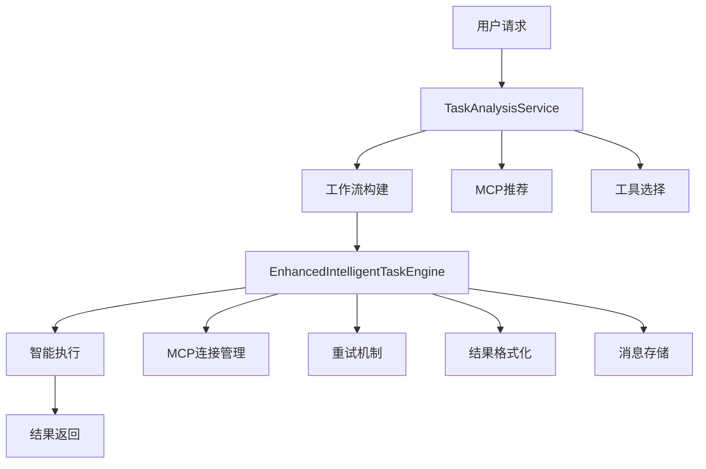

# Enhanced Task Engine Guide

## 📋 概述

增强任务引擎 (Enhanced Task Engine) 是对原有任务执行系统的重大升级，它结合了Agent智能引擎的优势，为任务执行提供了更智能、更可靠、更用户友好的执行体验。

### 🎯 核心设计理念

**分析与执行分离**: 
- **TaskAnalysisService**: 负责理解需求、推荐工具、构建工作流
- **EnhancedIntelligentTaskEngine**: 负责智能执行已构建的工作流

这种架构确保了任务分析（一次性）与任务执行（可重复）的完全分离，既保证了执行的高效性，又具备了智能化的优势。

## 🏗️ 系统架构

### 核心组件



### 主要类和接口

#### 1. `EnhancedIntelligentTaskEngine`
```typescript
export class EnhancedIntelligentTaskEngine {
  async *executeWorkflowEnhanced(
    taskId: string,
    mcpWorkflow: any
  ): AsyncGenerator<{ event: string; data: any }, boolean, unknown>
}
```

#### 2. `WorkflowStep`
```typescript
export interface WorkflowStep {
  step: number;
  mcp: string;
  action: string;
  input?: any;
  // 增强字段
  status?: 'pending' | 'executing' | 'completed' | 'failed';
  result?: any;
  error?: string;
  attempts?: number;
  maxRetries?: number;
}
```

#### 3. `EnhancedWorkflowState`
```typescript
export interface EnhancedWorkflowState {
  taskId: string;
  originalQuery: string;
  workflow: WorkflowStep[];
  currentStepIndex: number;
  executionHistory: Array<{...}>;
  dataStore: Record<string, any>;
  isComplete: boolean;
  totalSteps: number;
  completedSteps: number;
  failedSteps: number;
}
```

## 🔄 执行流程

### 完整执行链路

1. **任务创建** → 2. **任务分析** → 3. **工作流构建** → 4. **智能执行** → 5. **结果返回**

#### 阶段一：任务分析 (TaskAnalysisService)

```http
POST /api/task/:id/analyze/stream
```

**功能**:
- 🔍 分析任务内容和用户需求
- 🎯 推荐合适的MCP服务
- 🔧 构建具体的执行工作流
- 💾 将工作流存储到任务记录

**输出工作流示例**:
```json
{
  "workflow": [
    {
      "step": 1,
      "mcp": "coingecko-mcp", 
      "action": "getPriceData",
      "input": { "symbol": "bitcoin" }
    },
    {
      "step": 2,
      "mcp": "coingecko-mcp",
      "action": "getMarketChart", 
      "input": { "days": 30 }
    },
    {
      "step": 3,
      "mcp": "llm",
      "action": "analyzeTrend",
      "input": { "data": "{{step_1_result}}" }
    }
  ],
  "mcps": [
    { "name": "coingecko-mcp", "description": "..." }
  ]
}
```

#### 阶段二：智能执行 (EnhancedIntelligentTaskEngine)

```http
POST /api/task/:id/execute/stream
POST /api/task/:id/execute/enhanced
```

**执行特性**:

##### 🔧 智能化功能
- **失败重试**: 每个步骤最多重试2次，递增延迟
- **智能参数推导**: 从上下文自动推导步骤参数
- **MCP连接管理**: 自动确保所需MCP已连接
- **错误分类处理**: 区分连接错误、认证错误等

##### 📊 结果处理
- **双重格式化**: 原始结果 + LLM格式化结果
- **流式输出**: 实时发送执行状态和结果
- **消息存储**: 每步骤存储两条消息（原始+格式化）

## 🚀 API 接口

### 1. 任务分析接口

```http
POST /api/task/:id/analyze/stream
Content-Type: text/event-stream
```

**请求参数**:
```json
{
  "userId": "string" // 可选，从认证token获取
}
```

**响应事件**:
```javascript
// 分析开始
{ "event": "analysis_start", "data": { "taskId": "...", "timestamp": "..." } }

// 状态更新
{ "event": "status_update", "data": { "status": "in_progress" } }

// MCP推荐
{ "event": "mcp_recommendation", "data": { "recommendedMCPs": [...] } }

// 工作流构建
{ "event": "workflow_built", "data": { "workflow": [...] } }

// 分析完成
{ "event": "analysis_complete", "data": { "success": true } }
```

### 2. 任务执行接口

#### 标准执行
```http
POST /api/task/:id/execute/stream
Content-Type: text/event-stream
```

#### 增强执行
```http
POST /api/task/:id/execute/enhanced
Content-Type: text/event-stream
```

**请求参数**:
```json
{
  "userId": "string", // 可选
  "skipAnalysis": false // 可选，是否跳过工作流检查
}
```

**响应事件流**:

```javascript
// 执行开始
{
  "event": "execution_start",
  "data": {
    "taskId": "...",
    "mode": "enhanced",
    "workflowInfo": {
      "totalSteps": 3,
      "mcps": ["coingecko-mcp"]
    }
  }
}

// 工作流执行开始
{
  "event": "workflow_execution_start", 
  "data": {
    "totalSteps": 3,
    "workflow": [...]
  }
}

// 步骤执行
{
  "event": "step_executing",
  "data": {
    "step": 1,
    "toolDetails": {
      "toolType": "mcp",
      "toolName": "getPriceData",
      "mcpName": "coingecko-mcp",
      "args": {...},
      "reasoning": "获取比特币价格数据"
    }
  }
}

// 原始结果
{
  "event": "step_raw_result",
  "data": {
    "step": 1,
    "success": true,
    "rawResult": { "price": 45000, "change": "+2.5%" },
    "executionDetails": {
      "toolType": "mcp",
      "attempts": 1,
      "timestamp": "..."
    }
  }
}

// 格式化结果
{
  "event": "step_formatted_result", 
  "data": {
    "step": 1,
    "success": true,
    "formattedResult": "## 比特币价格数据\n\n当前价格: $45,000\n涨跌: +2.5%",
    "formattingDetails": {
      "originalDataSize": 156,
      "formattedDataSize": 67,
      "needsFormatting": true
    }
  }
}

// 步骤完成
{
  "event": "step_complete",
  "data": {
    "step": 1,
    "success": true,
    "progress": {
      "completed": 1,
      "total": 3,
      "percentage": 33
    }
  }
}

// 最终结果
{
  "event": "final_result",
  "data": {
    "finalResult": "...",
    "success": true,
    "executionSummary": {
      "totalSteps": 3,
      "completedSteps": 3,
      "failedSteps": 0,
      "successRate": 100
    }
  }
}
```

### 3. 错误处理事件

#### MCP连接错误
```javascript
{
  "event": "mcp_connection_error",
  "data": {
    "mcpName": "coingecko-mcp",
    "step": 1,
    "errorType": "CONNECTION_FAILED",
    "message": "Failed to connect to MCP service",
    "timestamp": "..."
  }
}
```

#### 步骤执行错误
```javascript
{
  "event": "step_error",
  "data": {
    "step": 1,
    "error": "API rate limit exceeded",
    "mcpName": "coingecko-mcp", 
    "action": "getPriceData",
    "attempts": 2
  }
}
```

## 🔧 技术实现细节

### 1. 重试机制

```typescript
private async executeWorkflowStepWithRetry(
  step: WorkflowStep, 
  state: EnhancedWorkflowState
): Promise<{success: boolean; result?: any; error?: string}> {
  let lastError = '';
  
  for (let attempt = 1; attempt <= (step.maxRetries || 2) + 1; attempt++) {
    try {
      const result = await this.executeWorkflowStep(step, state);
      if (result.success) return result;
      
      // 递增延迟重试
      if (attempt <= (step.maxRetries || 2)) {
        await new Promise(resolve => setTimeout(resolve, 1000 * attempt));
      }
    } catch (error) {
      lastError = error.message;
    }
  }
  
  return { success: false, error: lastError };
}
```

### 2. 智能参数推导

```typescript
private inferStepInputFromContext(
  step: WorkflowStep, 
  state: EnhancedWorkflowState
): any {
  const lastResult = state.dataStore.lastResult;
  const action = step.action.toLowerCase();
  
  // 基于上下文和动作类型智能推导
  if (lastResult && typeof lastResult === 'object') {
    if (action.includes('tweet') && lastResult.text) {
      return { content: lastResult.text };
    }
    if (action.includes('search') && lastResult.query) {
      return { query: lastResult.query };
    }
    // ... 更多推导规则
  }
  
  return {};
}
```

### 3. 结果格式化

```typescript
private async generateFormattedResult(
  rawResult: any, 
  mcpName: string, 
  action: string
): Promise<string> {
  const prompt = `Format the following MCP result for better readability:

**MCP**: ${mcpName}
**Action**: ${action}  
**Raw Result**: ${JSON.stringify(rawResult, null, 2)}

Please format this result in a clear, user-friendly way with appropriate markdown formatting.`;

  const response = await this.llm.invoke([new SystemMessage(prompt)]);
  return response.content as string;
}
```

### 4. 消息存储

每个执行步骤会创建两条独立的消息：

#### 原始结果消息
```typescript
await messageDao.createMessage({
  conversationId: task.conversationId,
  content: `Workflow Step ${stepNumber} Raw Result: ${step.mcp}.${step.action}\n\n${JSON.stringify(rawResult, null, 2)}`,
  type: MessageType.ASSISTANT,
  intent: MessageIntent.TASK,
  taskId,
  metadata: {
    stepType: MessageStepType.EXECUTION,
    contentType: 'raw_result',
    toolDetails: {...},
    executionDetails: {...}
  }
});
```

#### 格式化结果消息
```typescript
await messageDao.createMessage({
  conversationId: task.conversationId,
  content: `Workflow Step ${stepNumber} Formatted Result: ${step.mcp}.${step.action}\n\n${formattedResult}`,
  type: MessageType.ASSISTANT, 
  intent: MessageIntent.TASK,
  taskId,
  metadata: {
    stepType: MessageStepType.EXECUTION,
    contentType: 'formatted_result',
    toolDetails: {...},
    executionDetails: {...}
  }
});
```

## 🎚️ 配置选项

### 全局开关

在 `taskExecutorService.ts` 中：

```typescript
const ENABLE_INTELLIGENT_WORKFLOW = true; // 启用智能工作流
```

当开关为 `true` 时，所有任务执行都会使用增强引擎。
当开关为 `false` 时，回退到传统LangChain执行。

### 引擎参数

```typescript
// 最大重试次数
step.maxRetries = 2;

// LLM模型配置
this.llm = new ChatOpenAI({
  modelName: 'gpt-4o',
  temperature: 0.1,
});
```

## 🚨 错误处理策略

### 1. MCP连接错误
- **检测**: 监听连接失败、认证错误
- **处理**: 发送专用 `mcp_connection_error` 事件
- **恢复**: 自动重试连接

### 2. 工具执行错误  
- **重试**: 最多2次，递增延迟
- **降级**: 失败后跳过或使用替代工具
- **报告**: 详细的错误信息和建议

### 3. 数据格式错误
- **验证**: 检查返回数据的有效性
- **处理**: 智能数据清洗和转换
- **兜底**: 返回原始数据

## 📊 性能优化

### 1. 并发控制
- 步骤间串行执行，确保数据依赖
- MCP连接池复用
- 结果缓存机制

### 2. 资源管理
- 及时释放MCP连接
- 限制重试次数和超时
- 内存使用监控

### 3. 流式优化
- 实时发送执行状态
- 分块传输大数据
- 压缩响应内容

## 🔮 未来扩展

### 计划功能
1. **并行执行**: 支持工作流步骤的并行执行
2. **动态调整**: 根据执行情况动态调整工作流
3. **性能监控**: 详细的执行性能分析
4. **A/B测试**: 不同执行策略的对比测试

### 扩展点
- 自定义重试策略
- 插件化工具支持
- 多种格式化模板
- 高级错误恢复机制

## 💡 最佳实践

### 1. 工作流设计
- 保持步骤的原子性
- 明确步骤间的数据依赖  
- 合理设置重试策略

### 2. 错误处理
- 为每种错误类型提供清晰的提示
- 实现优雅降级机制
- 记录详细的错误日志

### 3. 性能优化
- 避免不必要的数据转换
- 合理使用缓存机制
- 监控执行时间和资源使用

---

## 🏷️ 版本历史

- **v1.0** (2024-12): 初始版本，基础工作流执行
- **v2.0** (2024-12): 增强版本，集成Agent引擎优势
- **v2.1** (2024-12): 优化重试机制和错误处理
- **v2.2** (当前): 完善消息存储和流式事件 