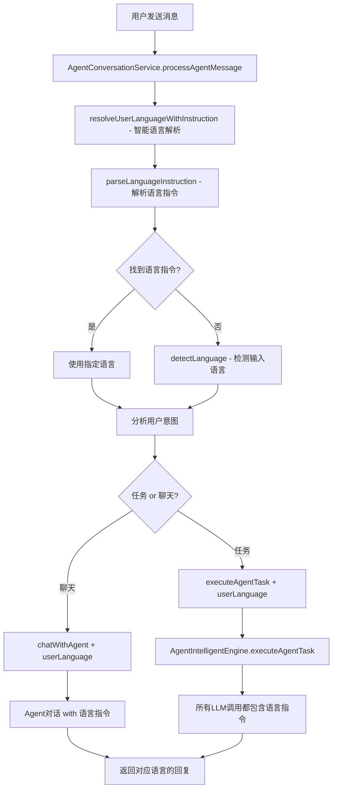
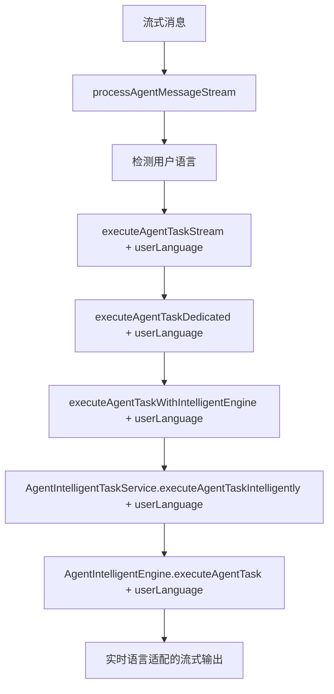

# 多语言支持完整实现

## 概述

本系统现已支持完整的多语言功能，可以自动检测用户的语言并使用相应语言回复。支持11种主要语言：中文、英文、日文、韩文、西班牙文、法文、德文、意大利文、葡萄牙文、俄文和阿拉伯文。

## 🎯 核心特性

### 1. 智能语言检测
- **语言指令解析**：优先识别用户明确指定的回复语言（如"用英语回答"、"Please answer in Korean"）
- **LLM主导检测**：使用LLM进行准确的语言检测
- **快速规则检测**：对明显特征进行快速识别（如日文假名、韩文、阿拉伯文等）
- **多层级fallback**：语言指令 → Agent默认语言 → 快速检测 → 英文默认

### 2. 统一语言流程
- **入口检测**：在`AgentConversationService`的消息处理入口统一检测用户语言
- **全链传递**：语言参数通过整个执行链条传递
- **一致体验**：Agent智能引擎和任务引擎都支持多语言

### 3. 灵活配置
- **Agent级别**：每个Agent可以设置默认语言
- **对话级别**：对话可以覆盖Agent的默认语言（预留功能）
- **实时检测**：每条消息都会检测语言，适应用户语言切换

## 🏗️ 架构实现

### 数据模型扩展

#### Agent模型
```typescript
export interface Agent {
  // ... existing fields
  language?: string; // Agent的默认语言 (ISO 639-1 代码)
}
```

#### Conversation模型
```typescript
export interface Conversation {
  // ... existing fields
  language?: string; // 会话语言设置，可覆盖Agent默认语言
}
```

#### AgentWorkflowState
```typescript
export interface AgentWorkflowState {
  // ... existing fields
  userLanguage?: SupportedLanguage; // 用户语言
}
```

### 语言检测工具

#### `src/utils/languageDetector.ts`
```typescript
// 支持的语言
const SUPPORTED_LANGUAGES = {
  'zh': '中文 (Chinese)',
  'en': 'English',
  'ja': '日本語 (Japanese)',
  'ko': '한국어 (Korean)',
  // ... 其他语言
};

// 核心检测函数
async function detectLanguage(text: string): Promise<SupportedLanguage>
function detectLanguageSync(text: string): SupportedLanguage

// 语言指令解析 (新功能)
async function parseLanguageInstruction(userMessage: string): Promise<SupportedLanguage | null>
async function resolveUserLanguageWithInstruction(...): Promise<SupportedLanguage>

// 传统语言解析
function resolveUserLanguage(...): SupportedLanguage
async function resolveUserLanguageAsync(...): Promise<SupportedLanguage>

// 工具函数
function getLanguageInstruction(lang: SupportedLanguage): string
function isValidLanguageCode(langCode: string): boolean
```

### 服务层集成

#### AgentConversationService
- **消息入口**：`processAgentMessage()` 和 `processAgentMessageStream()`
- **语言检测**：使用 `resolveUserLanguageAsync()` 进行异步检测
- **参数传递**：将检测到的语言传递给下游服务

#### AgentIntelligentEngine
- **状态管理**：在 `AgentWorkflowState` 中存储用户语言
- **提示词集成**：所有LLM提示词都集成语言指令
- **方法覆盖**：
  - `buildIntelligentDataSufficiencyPrompt()`
  - `buildEnhancedAgentPlannerPrompt()`
  - `buildUniversalLLMPrompt()`
  - `generateAgentFinalResultStream()`

#### TaskExecutorService
- **格式化方法**：`formatResultWithLLM()` 和 `formatResultWithLLMStream()`
- **语言检测**：在格式化时检测用户语言
- **语言指令**：添加相应语言的输出指令

## 🎯 语言指令解析

### 核心功能

系统能够智能识别用户消息中的明确语言指令，并优先使用指定的语言进行回复。

### 支持的语言指令模式

#### 中文指令
- `用[语言]回答` / `用[语言]回复`
- `请用英语分析...` 
- `用韩语介绍...`

#### 英文指令  
- `Please answer in [language]`
- `Reply in [language]`
- `Can you explain ... in [language]?`

#### 韩文指令
- `한국어로 답변해주세요`
- `영어로 대답해주세요`

#### 日文指令
- `日本語で答えてください`
- `英語で説明してください`

#### 其他语言指令
- `Répondez en français` (法语)
- `Responda en español` (西班牙语)

### 实现逻辑

```typescript
// 1. 首先解析语言指令
const instructedLanguage = await parseLanguageInstruction(userMessage);

// 2. 如果有明确指令，直接使用
if (instructedLanguage) {
  return instructedLanguage;
}

// 3. 否则使用常规语言检测
return await detectLanguage(userMessage);
```

### 使用示例

```typescript
// 用户消息：请用英语帮我分析以太坊价格
const language = await resolveUserLanguageWithInstruction(
  "请用英语帮我分析以太坊价格",
  "zh" // Agent默认中文
);
// 结果：'en' (英语)

// 用户消息：比特币现在多少钱？
const language = await resolveUserLanguageWithInstruction(
  "比特币现在多少钱？", 
  "zh" // Agent默认中文
);
// 结果：'zh' (中文，基于输入检测)
```

## 🔄 执行流程

### 1. 用户消息处理流程



### 2. 流式处理流程



## 📝 语言指令生成

### `getLanguageInstruction()` 函数
根据检测到的语言生成相应的LLM指令：

```typescript
function getLanguageInstruction(targetLanguage: SupportedLanguage): string {
  return `\n\n🌍 **LANGUAGE INSTRUCTION**: Please respond in ${getLanguageName(targetLanguage)}. Use natural, fluent language throughout your response.`;
}
```

### 语言名称映射
```typescript
const LANGUAGE_NAMES = {
  'zh': '中文',
  'ja': '日本語',
  'ko': '한국어',
  'es': 'Español',
  // ... 其他语言
};
```

## 🧪 测试和验证

### 测试场景
1. **语言指令解析**：测试各种语言指令模式的识别准确性
2. **中文用户**：发送中文消息，期望中文回复
3. **多语言切换**：在同一对话中切换语言
4. **明确语言指令**：用户指定特定语言回复（如"用英语回答"）
5. **Agent默认语言**：创建带有默认语言的Agent
6. **复杂任务**：多步骤任务的语言一致性
7. **流式输出**：实时语言适配

### 验证方法

#### 1. 测试语言指令解析
```bash
# 运行语言指令解析测试
node test-language-instruction-parsing.js
```

#### 2. API测试
```bash
# 启动服务
npm start

# 创建多语言Agent
curl -X POST http://localhost:3000/api/agents \
  -H "Content-Type: application/json" \
  -d '{"name": "多语言助手", "language": "zh"}'

# 测试中文对话
curl -X POST http://localhost:3000/api/conversations/{id}/messages/stream \
  -H "Content-Type: application/json" \
  -d '{"content": "你好，请帮我查询以太坊价格"}'

# 测试语言指令
curl -X POST http://localhost:3000/api/conversations/{id}/messages/stream \
  -H "Content-Type: application/json" \
  -d '{"content": "请用英语帮我分析比特币价格趋势"}'

# 测试韩语指令  
curl -X POST http://localhost:3000/api/conversations/{id}/messages/stream \
  -H "Content-Type: application/json" \
  -d '{"content": "한국어로 답변해주세요: 이더리움이 뭔가요?"}'
```

## 🔧 配置选项

### 环境变量
```bash
# OpenAI API Key（用于语言检测）
OPENAI_API_KEY=your_api_key

# 默认语言设置
DEFAULT_LANGUAGE=en
```

### Agent配置
```json
{
  "name": "国际化助手",
  "description": "支持多语言的AI助手",
  "language": "zh",
  "mcpWorkflow": {
    "mcps": [...]
  }
}
```

## 📊 性能优化

### 1. 语言检测缓存
- **快速检测优先**：明显特征直接识别，避免LLM调用
- **异步检测**：不阻塞主要业务流程
- **规则优化**：针对常见语言优化检测规则

### 2. 内存使用
- **轻量级存储**：在工作流状态中只存储语言代码
- **按需加载**：语言指令按需生成，不预加载

### 3. 网络优化
- **批量处理**：多个LLM调用合并语言指令
- **指令复用**：相同语言的指令模板复用

## 🚀 未来扩展

### 短期计划
1. **浏览器语言检测**：从HTTP请求头获取用户浏览器语言
2. **对话语言设置**：允许用户手动设置对话语言
3. **语言切换命令**：支持 `/lang zh` 等切换命令

### 长期计划
1. **更多语言支持**：扩展到更多小语种
2. **方言支持**：支持地区性语言变体
3. **语音语言检测**：集成语音输入的语言检测
4. **翻译服务**：提供实时翻译功能

## 🛠️ 故障排除

### 常见问题

#### 1. 语言检测不准确
- **检查输入**：确保输入文本有足够的语言特征
- **查看日志**：检查语言检测的日志输出
- **手动设置**：临时设置Agent默认语言

#### 2. 回复语言不正确
- **验证传递**：确认userLanguage参数正确传递
- **检查提示词**：确认LLM提示词包含语言指令
- **模型限制**：某些模型对特定语言支持较差

#### 3. 性能问题
- **禁用检测**：临时设置固定语言避免检测延迟
- **优化规则**：调整快速检测规则，减少LLM调用
- **缓存策略**：考虑添加用户语言偏好缓存

### 调试命令
```bash
# 查看语言检测日志
grep "Detected user language" logs/app.log

# 测试语言检测
node -e "
const { detectLanguage } = require('./src/utils/languageDetector.js');
detectLanguage('你好世界').then(console.log);
"
```

## 📚 相关文档

- [Agent API 文档](./API.md)
- [MCP 集成指南](./LANGCHAIN_MCP_INTEGRATION_GUIDE.md)
- [系统架构概览](./SYSTEM_OVERVIEW.md)
- [用户使用指南](./USER_GUIDE.md)

---

**实现完成日期**: 2024年12月
**维护团队**: MCP Server Development Team 